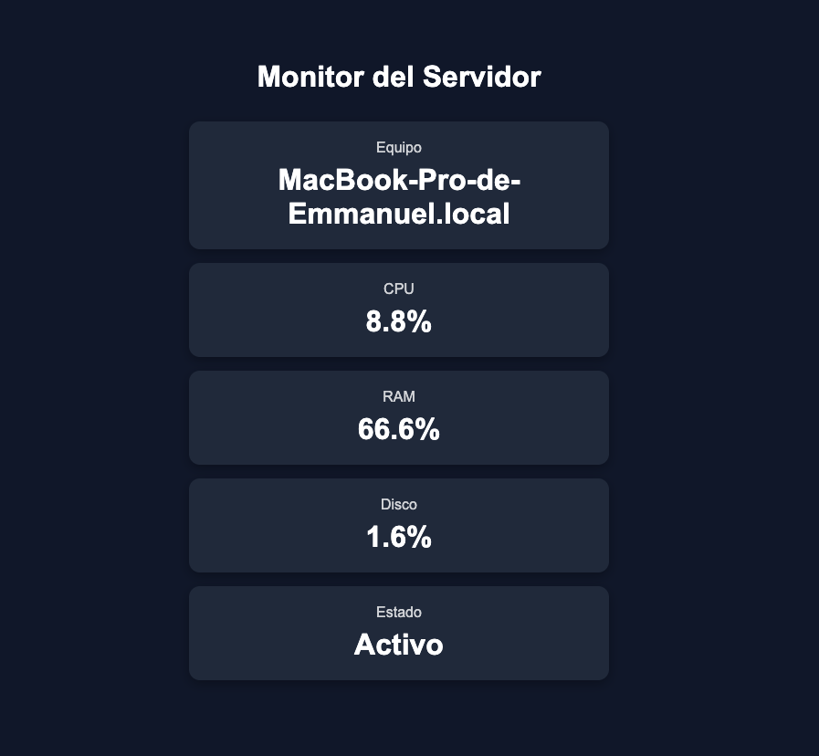

# Server Monitor Dashboard

Aplicación web simple para monitorear métricas básicas del sistema en tiempo real.

## Funcionalidades

- Uso de CPU
- Uso de RAM
- Uso de disco
- Nombre del equipo
- Estado del sistema
- Actualización automática cada 3 segundos

## Tecnologías utilizadas

- Python
- Flask
- psutil
- HTML
- CSS
- JavaScript

## Estructura del proyecto
